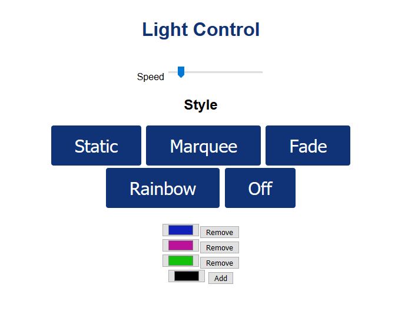

# ESP LIGHTS

A small micropython program to control WS2812b lights from an ESP32. The ESP32 hosts a small webpage and api to control the pattern and colors of the lights.

## Getting it up and running
Put boot.py, main.py, lights.py, and the www directory on the ESP32 using [ampy](https://github.com/scientifichackers/ampy) or similar. [MicrowebSrv2](https://github.com/jczic/MicroWebSrv2) is also required. Just put the files from MicrowebSrv2 into a directory named MicrowebSrv2 on the ESP32. Modify boot.py to use the correct SSID and password for your network.

On line 71 in main.py, change `pin` to the pin you have connected to your WS2812b lights and change `led_count` to the number of lights on your strand.

When the ESP32 boots up, it will connect to the local network. The ESP32 will host a small webpage and api. Navigate to the ip address of the ESP32 to see the webpage and change the pattern and colors of the lights.

## References
- https://randomnerdtutorials.com/esp32-esp8266-micropython-web-server/
- https://github.com/jczic/MicroWebSrv2
